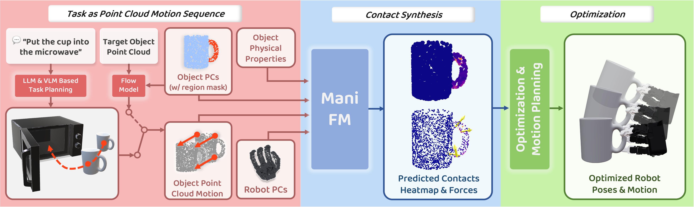

<p align="center">

  <h2 align="center"><a href="https://manifoundationmodel.github.io/">ManiFoundation Model for General-Purpose Robotic Manipulation of Contact Synthesis with Arbitrary Objects and Robots</a></h2>
  <p align="center">
    <a><strong>Zhixuan Xu*</strong></a>
    ·
    <a><strong>Chongkai Gao*</strong></a>
    ·
    <a><strong>Zixuan Liu*</strong></a>
    ·
    <a><strong>Gang Yang*</strong></a>
  </p>
  <p align="center">
    <a><strong>Chenrui Tie</strong></a>
    ·
    <a><strong>Haozhuo Zheng</strong></a>
    ·
    <a><strong>Haoyu Zhou</strong></a>
    ·
    <a><strong>Weikun Peng</strong></a>
    ·
    <a><strong>Debang Wang</strong></a>
    ·
    <a><strong>Tianyi Chen</strong></a>
    ·
    <a><strong>Zhouliang Yu</strong></a>
  </p>
  <p align="center">
    <a><strong>Lin Shao</strong></a>
  </p>
  <p align="center">
    <a>* denotes equal contribution</a>
  </p>

</p>

<div align="center">
    <a href="https://manifoundationmodel.github.io/" target="_blank">
    </a>
    <a href="https://manifoundationmodel.github.io/" target="_blank">
    </a>
</div>
</h2>


<div align="center">
  
</div>


This is the official code repository of **ManiFoundation Model for General-Purpose Robotic Manipulation of Contact Synthesis with Arbitrary Objects and Robots**.

## TODO
-[ ] Add dataset generation code.

-[ ] Add more hands.

-[ ] Upload 200K data.


## Installation

### 1. Create virtual environment

```bash
conda create -n mani python==3.8.18
conda activate mani
```

Not sure if other python versions are OK.

### 2. Install

1. Install [PyTorch](https://pytorch.org/). ManiFM is tested on CUDA version 11.7 and PyTorch version 2.0.1. Not sure if other versions are OK.

2. Install [PyTorch3D](https://pytorch3d.org/). We recommend to use the following commands to install:
```
pip install git+https://github.com/facebookresearch/pytorch3d.git
```

3. ```pip install -r requirements.txt```


## Dataset

The dataset should be put at the path specified in `configs/train.json`. 

The 3k dataset can be downloaded [here](https://drive.google.com/file/d/1id-lGt4oPDpMvRKnrV8BORRWvIWtPJle/view?usp=drive_link).
The 20k dataset can be downloaded [here](https://drive.google.com/file/d/10NzK18kPSNOFRqyTC8_xocPiEkFNryfE/view?usp=drive_link).

You can visualize the dataset with `scripts/vis_dataset.py`.

## Distributed Training

The distributed training is implemented with **[Accelerate](https://huggingface.co/docs/accelerate)** integrated with **[DeepSpeed](https://www.deepspeed.ai/)**. The detailed tutorials can be found at the [official website](https://huggingface.co/docs/accelerate/basic_tutorials/overview). The existing config file `configs/acc_config.yaml` is used to train on one single machine with two GPUs. You can generate your own config file with prompts using the following command to replace `configs/acc_config.yaml`.

```
accelerator config --config_file configs/acc_config.yaml
```

## Training 

```
bash scripts/train.sh
```

The saved models can be found at `logs/models`. Since **Accelerate** saves the model parameters as **[safetensors](https://huggingface.co/docs/safetensors)**, you need to load your model in the way like

```python
from safetensors.torch import load_model, save_model

...

load_model(model, "model.safetensors")
# Instead of model.load_state_dict(load_file("model.safetensors"))
```

## Evaluation

### Network

We provide a checkpoint trained on 200K dataset. You can use it to predict contact points and motion on rigid objects, clothes, rope, and plasticine. We provide a demo for each type of object in `scripts/pred.py`.

### Optimization

We provide the optimization code for two type of hands, **[LeapHand](https://www.leaphand.com/)** and **[AllegroHand](https://www.allegrohand.com/)**. Note that AllegroHand is not included in our training dataset. 

Run `scripts/pred_w_opt.py`.


## Cite

```
@misc{xu2024manifoundation,
      title={ManiFoundation Model for General-Purpose Robotic Manipulation of Contact Synthesis with Arbitrary Objects and Robots}, 
      author={Zhixuan Xu and Chongkai Gao and Zixuan Liu and Gang Yang and Chenrui Tie and Haozhuo Zheng and Haoyu Zhou and Weikun Peng and Debang Wang and Tianyi Chen and Zhouliang Yu and Lin Shao},
      year={2024},
      eprint={2405.06964},
      archivePrefix={arXiv},
      primaryClass={cs.RO}
}
```
